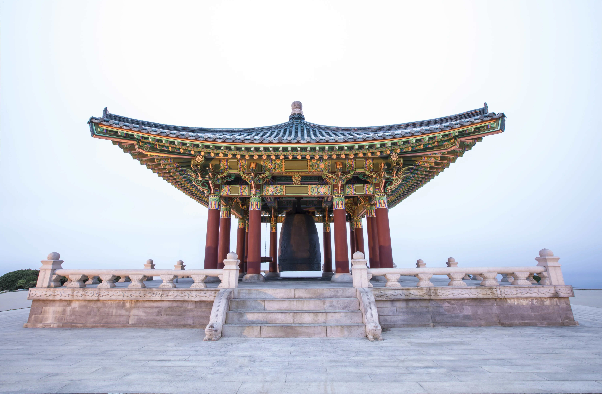

插入图像可以使用三种 shortcodes, 分别是:
- 单幅居中
- 单行多幅等高排列
- 瀑布流的相册


## 单幅居中
```markdown
{ {< myfigure src="/p/image-gallery/2153815980856311808.jpeg" title="Image 1" percent="60%">} }
```


## 等高排列
Stack 自带语法，参考了 [Typlog](https://typlog.com/), 使用了 [PhotoSwipe](https://photoswipe.com/). 
只支持本地图片，高度固定.

```markdown
 

  
```


 

  

## 瀑布流
参考：[Sulv's Blog](https://www.sulvblog.cn/posts/blog/hugo_gallery/)














































